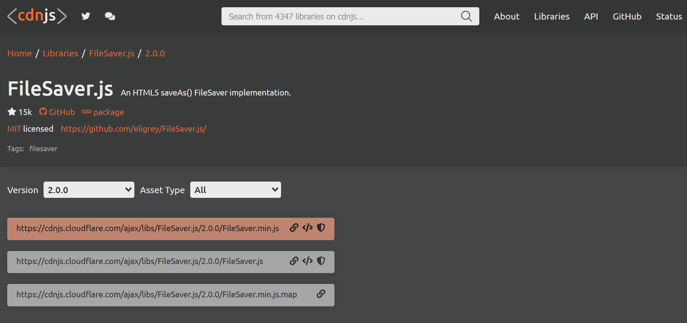
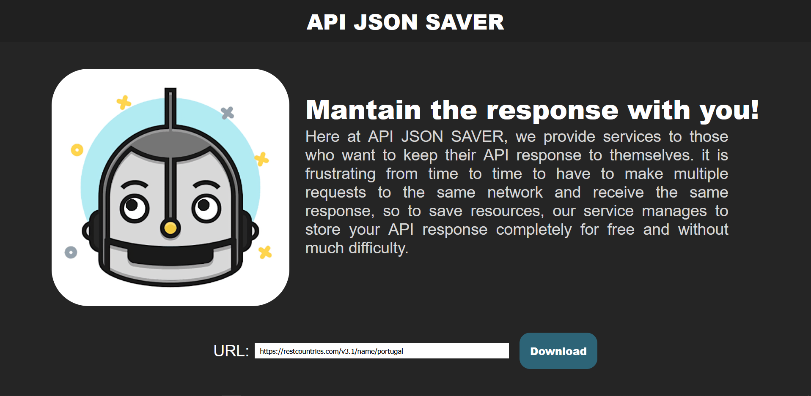

# API-JSON-Saver
## By [Luis Ramos](https://github.com/LuisRamosOfficial) 
This project was made with Vailla HTML CSS and Javascript.

## File Saver API

I used the [FIle Saver API](https://cdnjs.com/libraries/FileSaver.js/2.0.0) to make the Json Response downloadable!

## Screenshots

